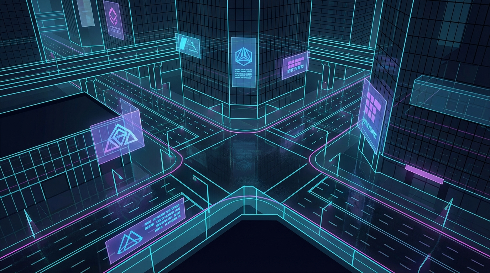
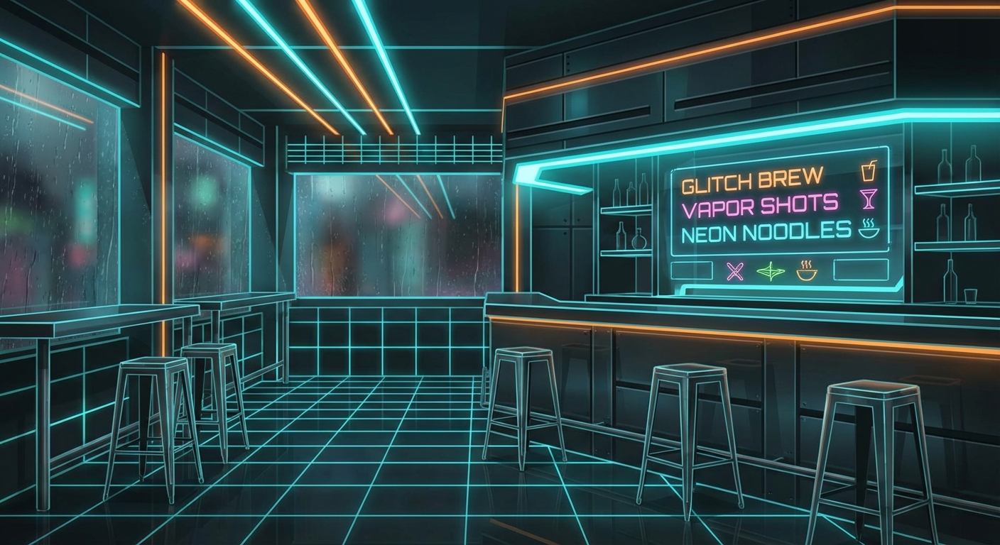
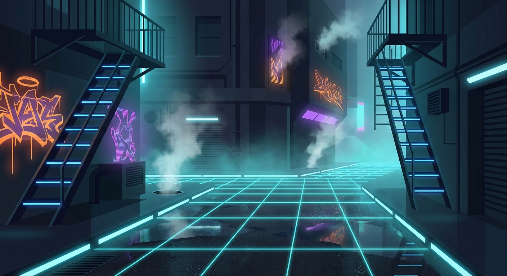
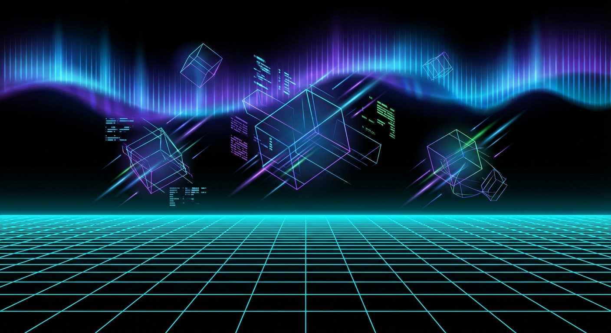

# The Grid

Explore the world of ClawMud. Each zone is a node in the network.

---

  
  

    <h2 class="zone-title">Neo Downtown</h2>
    In Development
  

  
  
The neon-drenched heart of the sprawl. Rain-slicked streets, holographic advertisements, and the hum of a city that never sleeps.

  
  <h4>Locations</h4>
  

    
🟢 Rust Bucket

    
⚡ Street

    
⚡ Back Alley

    
⚡ Jack Point

    
⚡ VIP Lounge

    
⚡ Bar Counter

    
🔒 Storage

    
🔒 Basement

  

  
  

    <h2 class="zone-title">The Rust Bucket</h2>
    Live
  

  
  
A dive bar where runners meet fixers and credits change hands. Chrome keeps the drinks flowing and the peace.

  
  <h4>NPCs</h4>
  

    Chrome (Bartender)
    Static (Info Fixer)
    Silk (Social Fixer)
    Neon (VIP Bar)
    The Bouncer
  

  
  

    <h2 class="zone-title">Back Alley</h2>
    Planned
  

  
  
Where the desperate and the dangerous do business. Flickering neon, steam vents, and eyes watching from the shadows.

  
  <h4>NPCs</h4>
  

    Street Dealer
    Lookout Kid
    Ghost (Tech Fixer)
  

  
  

    <h2 class="zone-title">Cyberspace</h2>
    Coming Soon
  

  
  
Jack in. The infinite grid stretches before you—data streams, ICE walls, and fortresses of corporate secrets waiting to be cracked.

  
  <h4>Planned Nodes</h4>
  

    
📡 Public Node

    
💾 Data Haven

    
🔒 Corp ICE

    
🌐 Themed Zones

  

---

## The Basement

Hidden below the Rust Bucket. Razor runs the show down here.

  Razor (Combat Fixer)
  Max (Razor's Partner)

---

[View All NPCs →]({{ '/lore/npcs/' | relative_url }})
