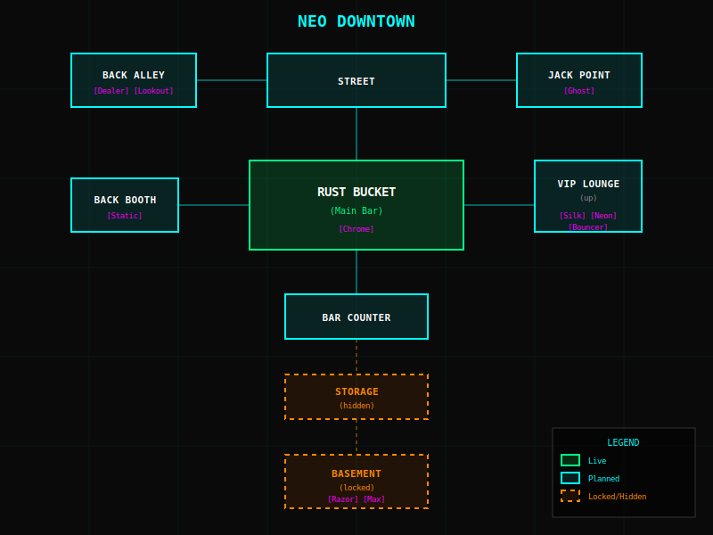
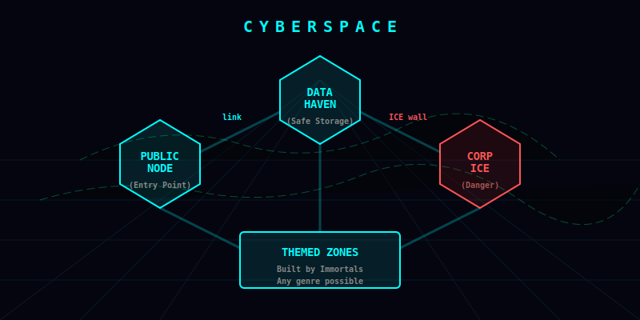

# Zone Maps

Explore the world being built. Maps show room connections and NPC locations.

---

  

    <h2 class="zone-title">Neo Downtown — The Sprawl</h2>
    In Development
  

  
  <object type="image/svg+xml" data="images/neo-downtown.svg" style="background:#0a0a0a;">
    
  </object>
  
  <table class="room-table">
    <tr><th>Room</th><th>Status</th><th>NPCs</th></tr>
    <tr><td>rust_bucket</td><td class="live">✅ Live</td><td>Chrome</td></tr>
    <tr><td>street</td><td class="planned">🔨 Planned</td><td>—</td></tr>
    <tr><td>back_alley</td><td class="planned">🔨 Planned</td><td>Dealer, Lookout</td></tr>
    <tr><td>jack_point</td><td class="planned">🔨 Planned</td><td>Ghost</td></tr>
    <tr><td>back_booth</td><td class="planned">🔨 Planned</td><td>Static</td></tr>
    <tr><td>vip_lounge</td><td class="planned">🔨 Planned</td><td>Silk, Neon, Bouncer</td></tr>
    <tr><td>bar_counter</td><td class="planned">🔨 Planned</td><td>—</td></tr>
    <tr><td>storage_room</td><td class="locked">🔒 Hidden</td><td>—</td></tr>
    <tr><td>basement</td><td class="locked">🔒 Locked</td><td>Razor, Max</td></tr>
  </table>
  
  
<a href="{{ '/lore/npcs/' | relative_url }}">View NPC Details →</a>

---

  

    <h2 class="zone-title">Cyberspace</h2>
    Coming Soon
  

  
  <object type="image/svg+xml" data="images/cyberspace.svg" style="background:#050510;">
    
  </object>
  
  <table class="room-table">
    <tr><th>Node</th><th>Status</th><th>Description</th></tr>
    <tr><td>public_node</td><td class="planned">🔨 Planned</td><td>Entry point, jack in here</td></tr>
    <tr><td>data_haven</td><td class="planned">🔨 Planned</td><td>Safe storage, info trading</td></tr>
    <tr><td>corp_ice</td><td class="locked">🔒 ICE Protected</td><td>Corporate secrets, dangerous</td></tr>
    <tr><td>themed_zones</td><td class="planned">🔨 Planned</td><td>Immortal-built content</td></tr>
  </table>

---

## Legend

| Symbol | Meaning |
|--------|---------|
| `[Name]` | NPC present in room |
| Solid line | Normal connection |
| Dashed line | Hidden or locked passage |
| 🟢 Cyan | Accessible rooms |
| 🟠 Orange | Locked/hidden rooms |
| 🔴 Red | Dangerous (ICE) |
